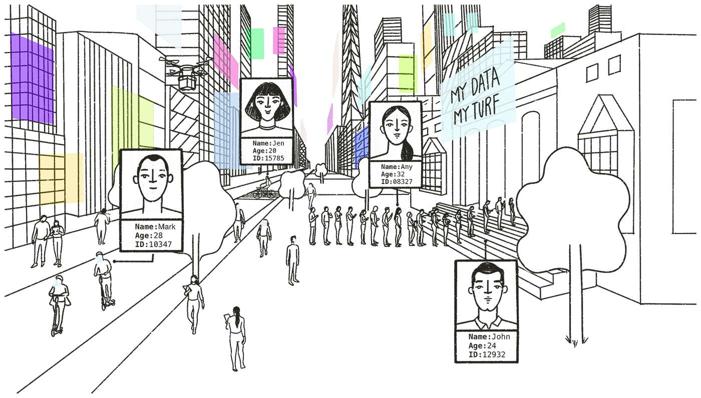

# Intro

We live in a world of hyper progress. Things are changing very much, very fast. Nobody knows exactly what’s going to happen in 10-20 years’ time,  but we can have foresight. It’s time to shape the future we want to see and take action.

> See your future. Make it. Be it. 

## Here’s where we start off

Our digital habitat is at a crossroads. There are challenges we need to address - like erosion of privacy and centralization of power, but there are also bright spots. We have amazing technology, and in Europe people have stronger privacy and data protection benchmark with the [GDPR](https://eur-lex.europa.eu/eli/reg/2016/679/oj) and there are efforts to strengthen data protection and privacy laws in countries around the world - today more countries have some form of data protection than don't. But most importantly, we have the power to unite and transform. The Internet can be a collective of action driven critical thinkers. We can change the course of our path. The future is not a given, our actions and decisions take us where we want to go.

In today's digital environment, here’s what we're not ok with:

## Data monopolies and surveillance

First, we don't like data monopolies. Big tech companies harvest our data on a massive scale, for their own interests. They are the new feudal lords, exploiting all our information. To surveil, predict and automate are [their new aspirations](https://www.vox.com/2019/3/27/18220373/google-facebook-big-tech). (add PI resource if available)

Surveillance machines like *Alexa* and *Google Assistant* have now entered into our homes. They [listen very carefully](https://www.bloomberg.com/news/articles/2019-04-10/is-anyone-listening-to-you-on-alexa-a-global-team-reviews-audio) to what we say, and they watch very closely what we do. 

Mobile devices travel with us everywhere we go, extracting and sharing data about our every move. Publicly and privately, we are being watched.   
 

## Things happening behind our backs

It’s not just the data we knowingly generate - such as photos or posts on social media - that gets harvested. It’s also the data we indirectly generate: our location history, browsing activity, what devices we use and lots more information that has been derived, inferred or predicted from other sources. For example, from my browsing patterns, companies can predict my gender, income, number of children, my shopping habits, interests, and insights about my social life. While in many countries data protection laws allow me to get access to all the data that online tracking companies collect, in most other places, [I can’t](https://privacyinternational.org/feature/2433/i-asked-online-tracking-company-all-my-data-and-heres-what-i-found). But things are not that easy. Even in the places where I can access data about me, first I need to know which company is collecting data. It's not a surprize that often times I am left unaware of the pervasive tracking. If I do find out, asking the company for access to data, is not a trivial task. It might be full of obstacles and difficulties - some intentional, some because of badly designed processes.

> We want human centric technology and we want transparency and respect.

## Restrictions on freedom of expression

Internet platforms limit our freedoms at an unprecedented scale. They monitor and decide what content is allowed on their apps and websites. They serve as the Internet police, building algorithms that decide what content is legal and what isn’t. What’s worse, in Europe, the power of platforms to restrict our freedoms is now enshrined into law. [A new copyright law](https://eur-lex.europa.eu/legal-content/EN/TXT/?uri=uriserv:OJ.L_.2019.130.01.0092.01.ENG) was adopted in March 2019 that forces on platforms the power to surveil, censor and dictate how we express and communicate with each other online.

## "Free" services 
We don't believe in "free" services anymore - we know our data is being exploited. Abusive data practices are used to track, target and influence our behaviour and opinions. In 2018, Cambridge Analytica showed us how this practice risks undermining democratic processes and weakening democracies. (add link to PI resources)

This is not to say that the solution to "free" services is paying for privacy enhanced products. Payment should not be the criteria for privacy. And companies offering "free" services should not mask data exploitation practices. 

> We want autonomy, choice and freedom. 

How? Here’s where our journey begins.
Below are four possible future scenarios. They’re presented through the eyes of Amtis, a fictional avatar representing an everyday internet user.

Amtis traveled forward in time and found four different futures: one where data is treated like property and data markets are created; one where people are paid for data as labour; one where data is stored in nationalized funds; and one where users have clear rights concerning their data.

Here’s what I collected from Amtis’ diary. I’ ve added a few bits of my own reflection at the end of each chapter as well, just to spice things up a bit :)

By the way - There's a blank space at the very end of this page. That’s because the last scenario is for you to write. Use the form at the end and submit your own. 

If you want to engage with this work further and write a comic book, do an art exhibition, an animation or a short video, drop me an email at [valentinap@privacyinternational.org](mailto:valentinap@privacyinternational.org)

I’d love to hear your ideas or to pitch you mine ;)

# Scenario 1 – Data ownership

In 2030 Amtis finds a future where data ownership looks a lot like property rights. Here's how this future plays out:

Data ownership was a new concept for everybody, and most of us put a lot of faith in it, assuming it would fix our digital challenges. But this new world still functioned with the old mentalities. You know how the saying goes – old habits die hard.

## First you have to prove ownership over data

Just like in May 2018 when the General Data Protection Regulation (GDPR) came into force, I am now flooded with notifications from companies asking either to confirm ownership over my data - or to sell it to them. The system worked like this: if I didn't want to recognize the data as my own property, I could sell it and the buyer would automatically receive ownership status over that data.

All these messages are mostly from subsidiaries of AllDataCorp (ADC) which has already amassed the largest silo of user profile data on the planet. The governments tried to push back and adopted a new law forcing ADC to process only data with clear ownership status. The penalty is dissolution so now ADC must clean up any dirty data they have harvested. But there’s a catch. 

## The new law means well, but fails to solve anything 

Through intense lobbying, ADC made sure regulators adopted a very difficult process for providing proof of ownership. Proof can be obtained through a painful bureaucratic process. I need to get my data verified by a central public-private body that issues ownership certificates. They first tried a blockchain enabled system, but it was too slow, energy consuming, and couldn't verify data at the source. So we are back to basic registries and a lot of red tape.

To be honest, I’m not even sure I fully understand what data I am actually getting ownership over. So screw it. I don’t want to waste my time. I am just going to sell my data and get it over with. 

*--- Amtis was getting hasty here, but would you have done differently? As I was curious to find out how much ADC offered, Amtis was quick to describe this with sarcastic frustration:*

ADC’s DataBrain SystemTM assessed my total worth at $99.36. It’s probably calculated based on analysing my data against their entire database. I don’t really have anything to say about this or negotiate the price. Needless to say there’s no explanation or other details besides that generous figure. I am also presented with an agreement through which the company retains full rights over my data to use and sell it further. I clicked “accept” and *Bon voyage, privacy!*

*--- There’s an even more troubling follow up in Amtis’ journal. If you’re looking for something bleak, this is it.*

In the end, people got very angry and protested in a very scary way (see below). Desperation grew and grew and more extreme models were proposed. 

## From individuals to Incorporated Persons

Take for example [Jennifer Lyn Morone](http://jenniferlynmorone.com/). She was an art student when she incorporated herself as a business in sign of protest. She became Jennifer Lyn Morone, Inc. She believed that *“the data a person creates should be considered their property: it has a monetary value in the economic system that our lives are structured around. So I see data as a resource that people create and that is currently being exploited” and “if people have ownership and control of their data they should be the ones compensated for it, not other companies.”*

Politicians started to encourage this model of Incorporated Persons as an alternative to social welfare and other public service “burdens” operated by the state. Legal entities don’t need social security. 

What initially started as a protest, now became common practice. It wasn’t easy to start Your Name, Inc. You needed legal, entrepreneurial and technical skills to run your company. So this model was more popular with middle class, educated people that were able to sustain this effort. The advantage was that your identity, name, IP address and every bit of data you created was your company/s property. This became the most effective solution for people to start owning their data and making money from it. In return, people also needed to take on some of the responsibilities of being a company. For example, they needed to compile and share their data records and accounts with the public register of the Commerce Office.

As this model got more and more traction, authorities followed the “will of the people” and changed a lot of policies to meet the demands. Under the pretext that this will save inequality, now, at birth, you become a legal person, setting yourself up like a corporation.

## Human Corporations

We are now a world of Human Corporations, functioning within a different type of social dynamic. For example, if someone wants a picture taken with their friends in a pub, or asks for advice where to eat in town, Jennifer Lyn Morone Inc. can offer this for a fee. Being a corporation allows her to market [all sorts of services and products](http://we-make-money-not-art.com/jennifer_lyn_morone_inc/). And she increases efficiency in life too: “If my friends and family became corporations I know exactly who I would use and for what and I know who I would invest in, not only because of what they can do but because of who they are.”

*–-- Amtis also described how the data markets looked like those days*

## Real time bidding architecture for selling data

ADC thought of everything to make it easier for everybody to exchange data - be it individuals or incorporated person. They set up a real-time bidding system which works like this: your data feeds straight into their platforms and you can immediately start to auction it. The AI behind the bidding platform analyzes how others have sold similar data points and adjusts the price accordingly. Depending on your choice, you can either set the system to automatically sell your data, or to stay pending until you click “I agree” for it to be sold. Except for very few exchanges between People Inc. themselves, 98% of the total transactions were bought by ADC. You could be poor, rich, or somewhere in the middle, no one escaped ADC’s data harvesting. 

## Time-locked subscriptions for data

As an alternative model, some small enclaves unionised and managed to get a slightly better deal from ADC. They forced the company to buy temporary subscriptions to their data, that were valid only for a limited period of time. But this is also very profitable for ADC and partners, as this ensures them a continuous stream of data for which they pay a mediocre monthly sum. Of course, if you became irrelevant to them, they would simply stop the subscription without explanation or any notice. The balance of power is still very much in their favour.

*--- Amtis added a few more thoughts on what was going on:*

## Data monopolies don’t die if I sell my data

All in all, I am left with a big burden to carry: more responsibility to manage my data and - except for the intellectual property protection for Incorporated Persons -, the rest of us have an almost nonexistent level of protection. I can’t call this system of ownership one of increased control. The new data auctioning market failed to give me real choice. Instead, it turned everything into a continuous struggle for survival. But the worse part is that ownership rights didn’t do anything to stop data monopolies and exploitative practices. 

In the end, ADC - and maybe a few others - have full control over all the data that has been historically generated. And they own it for good. They increased their dominant position and captured new slices of the markets. The one company now provides the entire suite of services I use on a daily basis.

*I don’t know how you feel, but for me reading Amtis diary on data ownership was really unsettling. What do you think? Enter your ideas in the thought bubbles on the side.*

*Here’s what I make out of this story on a more objective and legal level. If you're eager to read Scenario 2 click here.*

## Reflections on Scenario 1

### Data ownership does not mean more or better control

Attaching ownership rights to data is particularly problematic. Due to the nature of data, you can’t have exclusive property rights. It’s not as simple as with material goods, where you either have it or you don’t. Data can be here and everywhere and can be copied and transmitted at almost zero cost. Therefore, there are limited barriers that can be exercised with ownership rights and exclusivity. Consider home owners’ associations. You may be able to buy a house, but you need to get permission if you want to redesign your garden or change the paint colour.

### What is it exactly that I own?

Amtis only briefly hinted at it, but I don’t think there’s an easy consensus on what it is exactly that I could own. Is it my bank and credit statement, my smart meter reading, the GPS coordinates? How about my picture with my friends and family? If they are in the picture, do they own it too? What happens in the case of genetic data? It also contains information about my family, so if I reveal it, will my family also have ownership rights over it? My future children and grandchildren, too? Data about me is also data about other people.

Also, what happens to the data about me that is generated,derived, inferred and predicted without my knowledge? Would this be covered too? 

Designing a system of data ownership rights, would require a classification and inventory of all possible data types that can be owned, along with their state (e.g., data in transit, data in storage). Questions would include: What is the data that we assign ownership rights to? Is it the data that is being collected, or analysed, or aggregated, or the data that is being profiled? Would data in transit be owned as well, or only data that is already stored somewhere? Would the same data have multiple owners as in the examples above? Who would have control and access to this system? Would it be global, regional or national? How would it work as we and our data move around the globe?

### Ownership is not compatible with the nature of data

Here’s a legal argument to keep in mind. Intellectual property rights may seem at first akin to data ownership, but there’s a fundamental difference. Intellectual property law protects the original expression of an idea, not the idea or information itself. When we are talking about data, we can’t say that we have intellectual property rights over it, information is not protected per se.

But let’s say we are doing something with the data. Let’s say we are collecting it in a database and this takes quite a lot of effort and resources. In the case of EU law, the protection applies to the creation of the database, not the data entries themselves. More specifically, the resources invested in making the database are the object of protection, not the creation of a database in itself. This is called a sui generis right, different from copyright and data protection. See [CJEU case C-203/02, British Horseracing Board vs Hill, 2004](http://curia.europa.eu/juris/document/document.jsf?text=&docid=49633&pageIndex=0&doclang=EN&mode=lst&dir=&occ=first&part=1&cid=144600)

Similarly, if we discuss compilations (such as an anthology for example), the protection lies with the originality of selection and arrangement of information - it does not protect the individual elements that make the compilation. A compilation would be protected under copyright law. 

### Data markets in practical terms.

Let's imagine we somehow figured out all the questions related to ownership. Then we still need to consider the practical aspects of a data market. Let’s say in an ownership system, some individuals would presumably sell their data. Who is going to set the value and price? Based on what criteria? Am I going to have equal negotiation power? How would the money actually be transferred in practice? Will the price fluctuate depending on the markets in different countries and currencies? Will I need to spend time brokering or auctioning data? Would I need to pay for advice? Where would I go if I am not satisfied? Will I spend my time monitoring companies to make sure they actually respect the contractual agreement? Will I go to court if they don’t, and spend years awaiting for a resolution? Also, how would consent would be managed without producing decision exhaustion? Will we need to give instructions to our own bidding bots? Data ownership puts a lot of burden and responsibility on the individual to manage all data exchanges. Does this really mean more control?

Additionally, if I start selling data, companies would have very little incentive to promote any form of data transfers or portability from one service to the other, as they will be heavily invested in buying data. If we aren’t able to pull data from one company and move it to another in an easy way, we will just get trapped in the same corporate walled gardens of today. We won’t be able to complain to companies if we are dissatisfied.  What’s more, start ups and small companies would still rely on large investments in order to be able to compete with big companies when buying data. Regulating licensing of data would be extremely difficult and startups would be loyal to their investors, not to innovation and/or social good.

# Scenario 2 – Data labour 

In this next leap to year 2030, Amtis lives the life of a data labourer, being paid wages for data inputs. Here’s how Amtis begins the story:

I am in my green pyjamas, but I can’t say for sure if it’s morning or evening. My eyes are red from staring at the screens and I feel out of heart and very tired. Of course, all these emotions and reactions are registered by my Playbor – my pocket-sized smart console that’s basically my entire life. It’s my connection to family, friends and the world, my health and mood monitor, my life organiser and personal assistant and basically where and how I earn my living. It’s my Play and it’s my Labour. See Trebor Scholz, [Uberworked and Underpaid: How Workers Are Disrupting the Digital Economy](https://www.wiley.com/en-us/Uberworked+and+Underpaid%3A+How+Workers+Are+Disrupting+the+Digital+Economy-p-9780745653570).

These days, fewer and fewer people go to work in an actual office. Everything happens through this device, which captures the data I generate on different platforms and pays me for all these data inputs. But in reality, everything goes to one single company, as most of the other platforms are partners or affiliates of this big giant.

## Shit money, literally

Last month I enabled the “health” addon, so now the device is counting how frequently I go to the toilet and it connects to the sensors in the washroom to collect data about my pee and my poop. This data is sent to pharmaceutical companies so they can make better drugs. Maybe I'll help cure the world from urinary infections, prostate disorders, digestion problems and haemorrhoids. Every now and then I'm tempted to make a bad joke about shit money, but health data pays better than most others types, so I’ll shut up.

You know what else pays well? My “entertainment” data. I get bonuses for more juicy data such as my heart rate, eyeball movement and perspiration amount when I watch movies, hear an audiobook, play games or read articles. Data associated with political media pay even better. Now that I learned this trick, my behaviour changed a lot. I am watching all the movies recommended in my Playbor, I am frenetically consuming political articles, and trying to produce as much health related data as possible. My life and actions are all about how good they pay.

One time I even took laxatives to get more “results”. I was happy to see that I could tick the system, but after a few times I guess the algorithm detected a pattern and penalized me. Not only it took penalty money from my account, but it also placed a ban in pharmacies so that I can’t buy laxatives. Now, if I really have a digestion problem, I am screwed!  

## Training the AI overlord

Not many people know what all this is for. Everything that gets captured by this device is meant to train the world's most powerful AI system. So humans’ sole purpose in life is to teach this machine all we know, to help it evolve. The master plan is to transform it into an eternal collective extension of our humanity and train it to make better decisions for us. We’re already putting it in charge of our daily, more routine like decisions. More and more decisions from politicians and our government rely on this supermachine. Would the next step be to give it full control?

We're giving away our ability to make decisions for ourselves and we are trusting the machine to govern our world. We are enslaving ourselves in order to feed it data because that's the best way to get paid these days. As people [used to say](https://www.vox.com/2019/3/27/18216072/boss-socialism-capitalism-neoliberalism): "Better to be exploited in a capitalist society than unemployed and destitute."

## Both user and worker

People asked for data markets, so the data I contribute is now being paid for as labour. I have full work documentation registered with the platform - right from the moment my first bit of data reaches them. I have a dashboard in my console where I see how many tasks I performed, the price that was paid for each, how many days off I am entitled to (calculated based on how hard working I was), and what contribution goes to my pension plan. It’s funny that I am a user of these platforms, but also their worker. 

## The Taskometer is the employer’s new evaluation metric

Every time a company needs something, there’s a confederated AI Manager that splits the task into smaller chunks and sends alerts to workers to complete it. You have to be very fast when this happens, to make sure you get the task - just like you did a few decades ago with “crowdsourcing markets”. More advanced versions of the Playbor have an AI that selects the jobs for you, instead of you doing this manually. But this version of the console is more expensive. I am saving up to buy one later. The thing is, if you don’t complete 100,000,000 micro tasks per month, you don’t get paid at minimum wage level per task. The system works like this: you get paid by the task, but the price varies depending on the total amount of tasks you completed. And there are certain thresholds, and some evaluation criteria such as the quality of data. So you can’t be sloppy. If you’re below 100,000,000 in your Taskometer, the price per task is so small that you can barely keep your head up. But hey, now we can no longer say there’s fake unemployment. The Taskometer certifies my labour and evaluates my work. 

## Companies want subsidies from governments

I tried to speak with some of the union leaders about raising those thresholds. They told me that’s not going to happen any time soon, as companies are waiting for subsidies, but the government refuses. Until the government pays money, they can’t afford to raise the minimum threshold. Platforms are pushing the hands of governments because elections are coming up and politicians know that it’s through data analytics they are going to get voters. This makes me furious! Subsidies basically mean more tax money, more of our money! So we’re in a vicious circle. No wage increase until more money from government, no government money until more tax collection, no increased tax collection until we work more. And we’re exhausted.

## Data labour unions are weak 

So I suggested we organize a strike. If companies don’t have their workers, they lose users too. But since most of the essential services - and even the critical infrastructure of our city - are owned or operated by the same crowd, a strike will basically mean we’ll have to face total shut down. They will surely retaliate, as it was made clear a number of times in the past. They can cut off power, water and food supply in any given region in a matter of minutes. Some of us may be brave to take this on, but the majority of workers are scared and we haven’t reached a critical mass.

## Nobody escapes data exploitation

You might think that wealthier people got away in the data labour system. Actually, the discussion is more nuanced than that. It’s true that they could stay out of data labour and not hook their lives to a Playbor device - but they could not get away from sensors and tracking. The rich started building their walled cities where nobody else afforded to live in. The cities were sealed so that nobody outside their select group could come in. It had heavy surveillance infrastructure to achieve this. A truly smart city, some would say. And all the data produced by their houses, by their devices, by the sensors in their citadel, was all captured by the AI overlord. They were as much trapped in the same AI ecosystem as everybody else, but they had the illusion of privacy and protection from the plebes. 

## Privacy for pennies

The “data sharing economy” and automated services have displaced countless jobs. The majority of these people are now selling every bit of their data for a few pennies each. We are now seeing the true face of this type of economy based on "sharing".

Here’s what I make out of this story on a more objective and critical level. If you want to jump straight to Scenario 3 click here. 

## Reflections on Scenario 2

It seems like monopolies are not solvable through a data labour system. Monopolies don’t simply disappear, even if they start paying people wages - they adapt and persist. A market for data is very complicated to achieve in practical terms, but there are other reasons why this model may not be what we are looking for. 

A data labour system runs on people fuelling in data from all possible sources. This deepens the gap between the poor and the rich and it encourages inequality. While the rich will afford not to sell their data, the rest will be vulnerable, exposed and would give in more easily to exploitative systems. This looks much more like digital feudalism rather than individual empowerment. 

But the discussion goes beyond inequality. In a future where data labour is used to feed and train AI services applied in all aspects of our lives – from decision making about the way we govern ourselves, to our legal system, education and immigration – nobody will win in the long run.

### More tracking means more money

It’s true that data labour might be able to solve the problem of indirect data (e.g. data that you don’t know is extracted about you). But I am not sure this is the solution we are looking for. As all human actions, emotions and byproducts could potentially be monetized or labeled as labour, there was no more need for people to ask for transparency. In Amtis’ story, people already knew that tracking and sensitive information was going to bring them more money. There are no more abuses and exploitative practices because we put a price tag on them and thus we acknowledged them and provided them legitimacy. 

### In the long run, platforms crave quality data

The future will indisputably bring more AI services. To build better AI services, you not only need more data, but you also need data of a certain quality. It’s safe to assume that the majority of workers who will participate in a data labour system will be from marginalized, disadvantaged or poor communities. They can generally provide ordinary data, but from a certain point onwards this will not be enough. There will be certain types of data labour tasks that require specific skill sets, which won’t be easy for just anybody to perform. In other words, more educated workers could contribute to a bigger number of tasks, while less knowledgeable workers could pick from only a limited number of assignments. And this will create a lot of discrepancies and inequality. 

### Privacy is a time shifted risk

Needless to add here, information that I am okay with sharing (or selling) today might get me in serious trouble tomorrow. Change of political regimes is probably the most obvious example here. Remember in our not-so-distant history how totalitarian regimes asked you to declare your religion in official documents?

### Human beings instead of human doings

In the end, do we really want to monetize all aspects of our lives? Will this bring us well-being and social self-determination? Do we want to define ourselves by our data (generated for others) or by who we are? And more importantly, how can we make things better if everybody will still be looking for more and more financial gain? If we want to set ourselves up for a better future, we should probably look for ways how to [reduce wide-spread monetization of our lives](http://autonomy.work/wp-content/uploads/2018/05/Nick-Christine-Social-wealth.pdf).

# Scenario 3 – National Data Funds

In this third leap to 2030, Amtis sees that people have created national data funds where citizens and governments own together the data that is being generated by sensors or by the services people use.

Here’s how Amtis lives those times:

## Smart commuto-mobile

I am walking on the street and everything is high-tech. In the busiest parts of the city there are no more cars. There are only special lanes for drones, houndopacks – fast robots that run like dogs [insert boston dynamics] to deliver packages, and smart commuto-mobiles – slim electric booths where you can sit on your way to work and look at your phone without being worried about the traffic. It’s pretty cool – you can check your emails, take phone calls, schedule meetings, listen to a podcast on the best route to work. The commuto-mobiles drive themselves and are connected to high resolution cameras installed all over the city - so they have 360 degree eyes of the road. This also means that every conversation you have while in the smart commuto-mobile is recorded and processed in real time by an [AI Traffic Grid](https://www.nytimes.com/2012/03/04/business/ibm-takes-smarter-cities-concept-to-rio-de-janeiro.html). This is to keep everything safe – for example if you get angry and raise your voice while talking in your commuto-mobil, the vehicle pulls over and gives you a 20 minute time out to cool off, playing music and guided meditation practices. I bet you wouldn’t like to have this happening before an important meeting where you don’t want to be late! There’s no way you can hop back in and make it run until you haven’t calmed yourself down. And it [gets registered](https://www.theatlantic.com/entertainment/archive/2016/10/black-mirror-nosedive-review-season-three-netflix/504668/) into your "good behavior" record too! The AI Traffic Grid also has sensors that analyze your facial expression to determine emotions, your gestures to determine thought processes and intentionality, and your breathing patterns to determine your heart rate and anxiety level. See ["Stealing ur Feelings"](https://
www.engadget.com/2019/05/02/stealing-ur-feelings-ar-film-facial-recognition-tribeca-2019-kanye-pizza/)

## Employer knows if you worked during your commute

With  the commuto-mobile, traffic is much faster and the risk of accidents is  very low. Basically, while you are in your smart booth, you don’t need  to worry about anything besides boosting your productivity. Some people have even started asking for this time to be included in their working hours. And why not? They jump from bed straight into their  smart commuto-mobiles and get to work – who wants to lose time in  traffic? This is precisely why the commuto-mobiles were brought to the  market. The commuto-mobiles are connected to the Internet, and work reports are sent to employers to show exactly how you spent your  time on your way to work. Everything gets recorded in the log journey  anyway. 

## Data as a Service for the private sector

All the information that is generated from the city and the services we use is amassed into a big database that is managed by the government and citizens. This fund makes it easier for new companies that want to enter the market and need a lot of data. The idea is that if you want to use any of the datasets, you have to pay to get access. We’re calling this Data as a Service because it turns companies into the customers of our city. Access to these datasets is highly regulated and the more datasets you want to use, the more expensive it becomes. Also, depending on the sensitivity of the information, the price goes way up for example driving information is less expensive than health data). The money that the government receives from companies gets redistributed back to the people.

The data is anonymised, so  everything is safe and nothing can go wrong. Except there have already  been cases where companies bought the data to do reverse engineering and to reidentify the people so that it could create new surveillance products.  

Individuals and researchers can also apply to get the data they need. If the project benefits the entire community, your idea can be subsidized by the government. Through these subsidies, smaller, independent companies started to run good services, and it became harder to maintain a monopoly position on the market.

## We can build our own services

If there's a gap in the market, we can build the services that are missing ourselves. We have all the data at our disposal, and I think gradually this is what we are moving towards. However, for the moment these so-called “collective services” are not that great. Most of them are not easy to use and look really, really 2000.

*Here’s what I make out of this story on a more objective and critical level. If you're excited to move to Scenario 4 click here.*

## Reflections on Scenario 3

Besides National Data Funds, there are many more models to explore. Data ownership can be addressed in a lot of ways. National Data Funds don/t sound like a perfect solution, but they're not destructive, either.                                       

### Governments will have more control

In the National Data Fund model, the government also gets all the data we are generating. This means governments will also have more control. They will basically have every individual’s data and can infer patterns for masses, as well as behaviours and intentions. Will people still dare to protest when abuses happen? We all know how fragile democracies are and the risk of this turning into a techno-dictatorship is high. Around the world there are corrupt, oppressive and ruthless governmental regimes. And if they aren't now, they could become one very easily.

We will need super advanced security measures to ensure that these databases are not leaked, hacked, used in cyberwar or manipulated by foreign or domestic agents. Personal data will have to be anonymized, but [research already shows](https://www.nature.com/articles/srep01376) we need to do a lot more to improve anonymity techniques. And even so, handling anonymized data still can have a huge impact on individual lives. National Data Funds are a type of infrastructure that will take a long time to build and will be very expensive.

### Trusting governments with all our data

It would be very complicated to put all the necessary checks and balances in place, and to make sure the decisions are transparent without hidden agenda or secret deals between governments and companies. Also, even if there are no bad intentions in the middle, government structures will still have to change drastically. Entire teams of technical specialists will have to assess proposals coming from companies and take steps to ensure that security measures are in place for preventing abuse. Proposals would also need an ethical, sustainability and environmental checks – so a lot  of talent needs to be added to government. The public sector needs to get way more attractive in terms of  financial rewards for its specialists. Where would this money come from? Would the government be tempted to allow more companies access to data in order to build its budget? Or outsourse core services? These are hard operational and strategic decisions to take. Will governments have the backbone to make the correct ones? What if governments interests are aligned with a company’s interests? Exploitative services should not be allowed in the first place, but preventing this from happening will require a total transformation of the mindset we operate in - more than just an independent body under civilian oversight. 

### Security for databases

Needless to say, having a centralized database as a single point of failure is a very bad idea. The database could potentially be decentralized, to eliminate the central point of vulnerability. But does this mean the data is going to be in a public registry for everybody to see? From a technical point of view managing these databases is going to be extremely challenging. See the [Adhaar system](https://www.washingtonpost.com/news/theworldpost/wp/2018/08/09/aadhaar/?noredirect=on&utm_term=.20c68d07af7e)

### No incentives for companies 

One of the ideas for the National Data Funds is to ask companies to pay a share of their profit. Of course, there could be other models such as  subscription fees, subsidised access, completely free access, [access based on income](https://www.theguardian.com/technology/2017/jul/01/google-european-commission-fine-search-engines), or a mix of these. In our story, the companies had to pay twice: once for getting access to the data and again for the profit that data was generating. But we already see business models that deliberately run on losses (Uber, Amazon) in order to consolidate their position, kill competition and  promote the regulatory framework that’s best for them. Will the National Data Fund model solve this problem? You don’t want to maximize the revenue of the companies using the fund, but at the same time, where are  governments going to get the money for all the costs involved with technical management, deliberation and social benefit analysis?

### A lot of uncertainties

There are many more questions to think about. For example, by default will everybody’s data be captured? Is there a possibility not to contribute to the fund? And if I don’t contribute, will I be able to freely operate and  participate in society without major consequences? There’s also a lot to discuss about how this data pool is managed and how decisions are made by both governments and citizens. Will every point of view have the  same weight? How can we make sure citizens will not be threatened, pressured or forced to vouch for certain decisions? Also, what happens  if a company gets access to a database, but then misbehaves? Even if you cut their access to the database, the damage is already done, potentially harming millions. What will be the measures to ensure that the risks of abuses are mitigated?

# Scenario 4 – Data rights

It is obvious that we need to build a comprehensive system of protection and a very well designed framework to meet our digital challenges. I already gave it away in the  introduction, I think in this last scenario, Amtis finds a better candidate for our digital challenges with the data rights model.

This time, Amtis travels to a totally transformed word. It's still 2030. But everybody worked hard to improve the digital world for our well-being. We all chipped in and we got it our way. We shifted the way we govern ourselves, the way we live and do business, the way we think about technology and the way we interact. A lot more needs to be done, but we are on a steady course now. We learned from the past and we got clever. 

It all began with a grass-roots futurathon where engineers, artists, philosophers, youth, economists, lawyers, policy makers, environmentalists, LGBTQ+ communities - people from all walks of life - got together to work on a single project. To design The People’s Digitalopoly.  

Digitalopoly was a completely new social and economic system. It defined clear  principles for our well being and evolution – for making the world a better place for all. It was not based on financial gains, but on social  contribution and civic participation. Its foundational layer was a data rights model, which empowered individuals with choice and agency over their data. 

Amtis was in this futurathon and got involved with the tech group. Their mission was to reverse the logic of how many of the services operate, and to build new standards. For example, instead of a tracking model, they build an automatic “forget” standard for deleting all information about somebody in a maximum of 24 hours. At the same time they built standards explaining the type of personal data different service can use. But what Amtis was the most enthusiastic about was the data rights dashboard.

*Here’s how Amtis’ logs describe it:*

The best part of this data rights dashboard is that I can trace in real time all the data that refers to me: data that I knowingly generate, but also data that is being inferred, predicted or observed about me. The data rights dashboard shows me an interactive visual of exactly what type of data goes where, who is collecting it and how my data is being used all throughout the data processing chain – from the company that first obtained it, all the way down to all the sub-processors, affiliates and partner companies. I have granular control over the data elements and I can set the parameters and policies in which my data can be processed by others.

## Full control

With data rights, I have full control. The dashboard walks me through a setup screen: I want all my data to be deleted after three years; I don’t  allow any inferences on religion, sexuality and political views; I never want my data to be processed outside the People’s Digitalopoly. Based on these  preferences, companies know what I am okay with sharing and  what’s a big no-no. And there’s no stepping outside of these boundaries, because they are hardcoded into the protocols. As an additional level of protection, my preferences are integrated with the regulator’s  enforcement systems and any time there is any mistreatment of my data, I receive a notification that I can forward to my regulator.

## Data portability

What I enjoy the most is that I can easily switch from one service provider to another. The data rights system allowed for the evolution of highly-portable services based on open protocols. Now, I can pull all my data  from one operator and easily move it to another. This is a great incentive for companies to gain my trust and make sure not to screw up. More innovation and competition is flourishing. Smaller companies that were once cut off from the market simply because they couldn’t get enough data and customers, no longer have the mentality that their only chance is to be acquired by bigger companies. They have the incentive to play safe, be honest and earn customers’ trust because everybody competes at the same level. It’s a network effect where honesty is the first guiding principle. There’s no more vendor lock-in and I simply switch to another company and take the data to them. Good-bye data monopolies!

Now I decide the rules of data processing that affect me. My decisions come on top of a foundational layer of protection that all companies are required to comply with - such as careful design of the data processes, increased security and reducing the data they require to the minimum.

# Reflections

## Data rights as a comprehensive system of protection

Stepping out of the scenarios and grounding ourselves back in today’s realities, it’s unquestionable that people have a sense of resentment about the way data is harvested by data monopolies. We have lost control over the data we’re generating, and we are becoming more aware of exploitative practices. In order to address the power imbalances that plague our digital sphere, I believe we need a system that is able to provide individuals with clear, direct authority and autonomy over their data. One that allows us to set boundaries and to have real control. 

A data rights system allows us to access, change, move or delete data; to know who’s collecting it, where it’s being stored, where it’s going, who has access to it, and for what purposes. Data rights cover both data  that I voluntarily generate, but also data that is automatically collected about me. This includes location and browsing history, but also information that has been derived, inferred or predicted from other sources. In this sense a data rights system offers a much more comprehensive architecture of control and autonomy than ownership. 

That’s why, when an appropriate architecture of rights is in place, I essentially don’t need ownership rights. It is true though that this model puts more responsibility on the user, to manage and take informed decisions about what data goes where. On its own, a data rights system is not enough - a strong architecture to support it also needs to be put in place.

## Choice and transparency on top of well-designed data processes

But a data rights system also places a higher burden of responsibility on organisations. Data rights demand that organisations create a secure and protected environment for data processing and adopt a very transparent set of rules. Data processes need to be built from the outset by complying with the principles of privacy-by-design and by-default and data minimization. Protection is at the core and data is collected in a meaningful and transparent way. Then, organisations need to invest in data portability so that data can be easily moved from one service to another, the same way phone numbers can be ported  between different carriers. 

Data rights offer a solid framework. It’s the backbone for a healthy society, where individual empowerment and collective well-being is paramount. We need to advance and strengthen this architecture of rights with vigilant watchdogs and new socio-economic rationales — the muscles that keep the system in check. Third, we need well-designed data processes and user friendly data portability — the skin that ties everything together. 

## Develop new language

I think data ownership fails to address the main challenges of today’s digital economy. Ownership certainly doesn’t capture the full spectrum of related issues. An ownership system, even though it sounds like a good idea, is incapable of stopping exploitative data practices and monopolies on its own - it would simply allow them to adapt and persist.  If we keep our focus primarily on figuring out data ownership, we face the risk of sidetracking the discussion onto a very questionable path. This is an open invitation to develop new language that assists clearer conversations and to better shape our demands for the future we want to see. 

The next journey is for your to imagine. Start designing Scenario 5 right here. 

*End*

# Next steps

How do you see YOUR future? Tell us your first step for shaping it.

Don’t know exactly what the first step can be? Here are some suggestions:

1. European elections are coming up. Ask candidates what role they think data plays in the future. If you see a lack of foresight, engage in a deeper discussion with them. Make them listen and use the scenarios to explain how things might go wrong.

2. Start a data rights hub in your community.

    - There are a few discussion forums that are spending time thinking about what happens next and how to address our data challenges. There’s the My Data community (slack channel here) and the ResponsibleData.io mailing list.

    - There are also well-intentioned initiatives such as  RadicalxChange, but there might be some aspects that they promote that need a deeper reflection.

    - Another example is the DECODE Project.

3. Your creative skills are needed for spreading the data discussion more broadly. Reach out to [valentinap@privacyinternational.org](mailto:valentinap@privacyinternational.org) if you want to contribute to building a toolkit to make it easier for your friends and neighbours and for the world to engage with the topic. We could really benefit from bringing this topic to a larger community!
